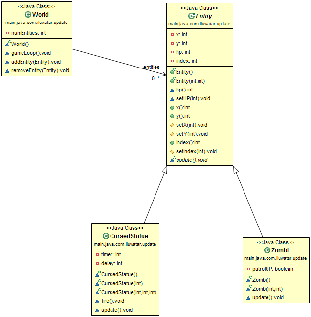

## Intent
Simulate a collection of independent objects by telling each to process one frame of behavior at a time.

## Applicability
If the Game Loop pattern is the best thing since sliced bread, then the Update Method pattern is its butter. A wide swath of games featuring live entities that the player interacts with use this pattern in some form or other. If the game has space marines, dragons, Martians, ghosts, or athletes, there’s a good chance it uses this pattern.

Update methods work well when:

* Your game has a number of objects or systems that need to run simultaneously.

* Each object’s behavior is mostly independent of the others.

* The objects need to be simulated over time.

## Real world examples

## Credits

* ["Game Programming Patterns" by Robert Nystrom](http://gameprogrammingpatterns.com/update-method.html)
